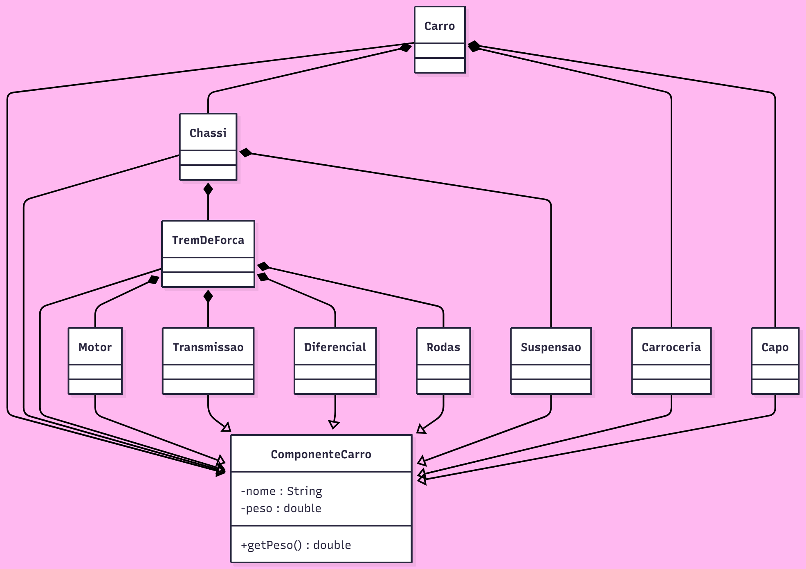

# Prompts Utilizados para a Atividade

---

## Prompt 1

> Me faça um codigo mermaid para um diagrama de classe seguindo o padrão composite da seguinte aplicação: eu tenho um carro, este carro é composto por um chassi um carroceria e um capo, dentro do chassi temos um trem de força e uma suspensão e dentro do trem de força temos um motor, uma transmissão diferencial e rodas. o diagrama deve ser tão simples quanto possível. 

 A IA gerou um diagrama com todas as classes corretas, porém o único método de todas elas eram exibir(), assim usei um segundo prompt: 
 
 > a parte do carro tem peso e nome, o objetivo do nosso programa é calcular o peso de um carro
 
Nisto a inteligência artificial gerou um diagrama agora com todos os métodos necessários, porém isso o deixou muito poluído e complexo, assim, ainda foi necessário o processo manual de enxugar as informações, com isso temos o seguinte diagrama feito a partir do código em formato mermaid renderizado em imagem através de uma ferramenta própria para isso:

